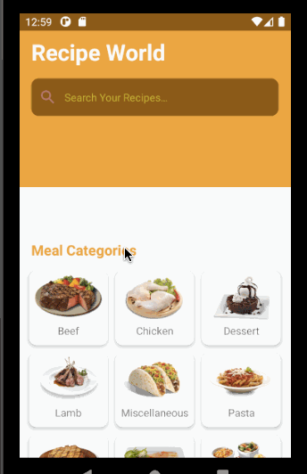

# Recipe World

## Table of Contents
1. [Overview](#Overview)
1. [Product Spec](#Product-Spec)
1. [Wireframes](#Wireframes)
1. [Schema](#Schema)

## Overview
### Description
Tracks what RECIPE an individual wants to cook with any type of recipe.  Could be potentially used as a social app, or just meeting new friends with similar recipe tastes.

### App Evaluation
- **Category:** Social Networking / FOOD
- **Mobile:** This app would be primarily developed for mobile but would perhaps be just as viable on a computer, such as mobile devices, however mobile version could potentially have more features, it will use for a data of good recipe.
- **Story:** User will be able to find simple recipe on the app. User will be able to post new recipe for cooking
- **Market:** Any individual could choose to use this app, and to keep it a safe environment, people would be organized into age groups.
- **Habit:** This app could be used as often or un often as the user wanted depending on how deep their social life is, and what exactly they're looking for.
- **Scope:** First we would start with pairing people based on food  taste, then perhaps this could evolve into a recipe sharing application as well to broaden its usage. Large potential for use with recipe.com, pinterest, or other recipe streaming applications.

## Product Spec
### 1. User Stories (Required and Optional)

**Required Must-have Stories**

- [X] User access home screen
- [X] User can search for specific recipes
- [X] User can choose a specific category
- [X] User can click on the category they liked to get a brief description
* User can see related meals based off of ingrediants
* User can save favorites by liking them
* Settings (Accesibility, Notification, General, etc.)

**Optional Nice-to-have Stories**

* Specific ingrediants can be shown
* Page of most cook recipe (i.e. recipes that most users are connecting through)
* Profile Add-On: Top Recipe choices, etc.
* The user can creat a profile
* User can upload recipes from their profile

### 2. Screen Archetypes

* Recipe Screen 
   * Allows user to search and choose what recipe they are interested in
* Recipe Selection Screen.
   * Allows user to be able to choose their desired recipe, artist, genre of preference and begin listening and interacting with others.
* Settings Screen
   * Lets people change language, and app notification settings.

### 3. Navigation

**Tab Navigation** (Tab to Screen)

* RECIPE selection
* Profile
* Settings

Optional:
*Recipe Queue
* Discover (Top Choices)

**Flow Navigation** (Screen to Screen)
* Home screen -> Search
  * search -> recipes that come up based on search
* Recipe Selection -> Jumps to recipe
* Home screen -> Category
  category --> description and meals based off that catory
* Settings -> Toggle settings

## Wireframes
https://github.com/RaniyaM/Recipe-/blob/main/IMG_3989.HEIC.pdf


## Schema 
### Models
#### Post

   | Property      | Type     | Description |
   | ------------- | -------- | ------------|
   | objectId      | String   | unique id for the user post (default field) |
   | author        | Pointer to User| image author |
   | image         | File     | image that user posts |
   | caption       | String   | image caption by author |
   | commentsCount | Number   | number of comments that has been posted to an image |
   | likesCount    | Number   | number of likes for the post |
   | createdAt     | DateTime | date when post is created (default field) |
   | updatedAt     | DateTime | date when post is last updated (default field) |
### Networking
#### List of network requests by screen
   - Home Feed Screen
      - (Read/GET) Query all posts where user is author
         ```swift
         let query = PFQuery(className:"Post")
         query.whereKey("author", equalTo: currentUser)
         query.order(byDescending: "createdAt")
         query.findObjectsInBackground { (posts: [PFObject]?, error: Error?) in
            if let error = error { 
               print(error.localizedDescription)
            } else if let posts = posts {
               print("Successfully retrieved \(posts.count) posts.")
           // TODO: Do something with posts...
            }
         }
         ```
      - (Create/POST) Create a new like on a post
      - (Delete) Delete existing like
      - (Create/POST) Create a new comment on a post
      - (Delete) Delete existing comment
   - Create Post Screen
      - (Create/POST) Create a new post object
 
   
### App Gifs

